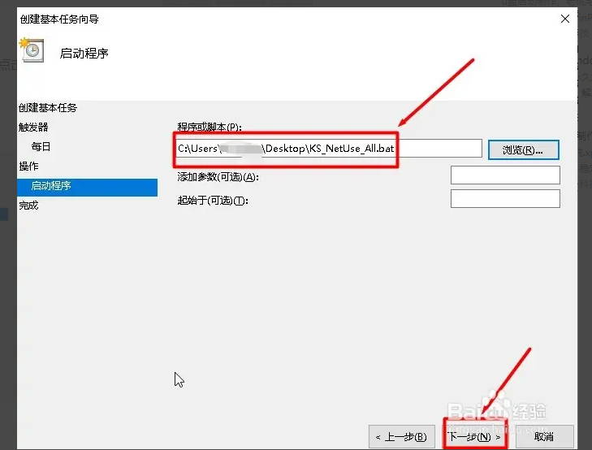
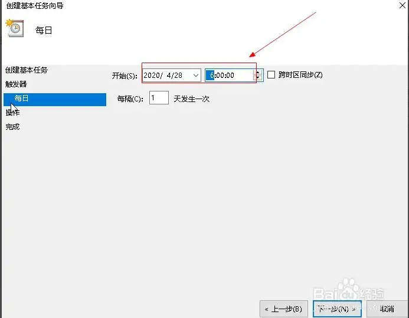
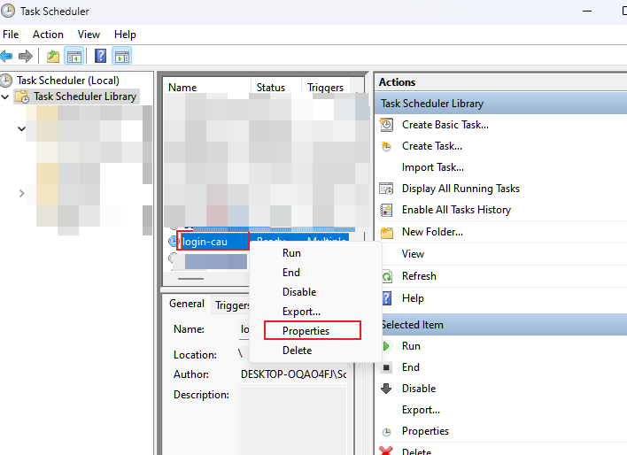
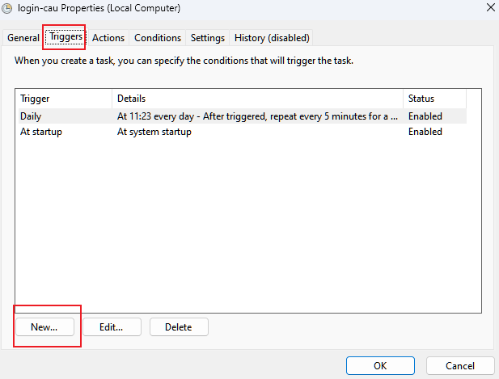
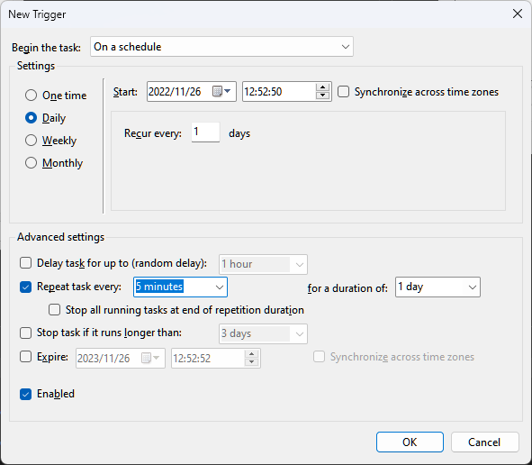
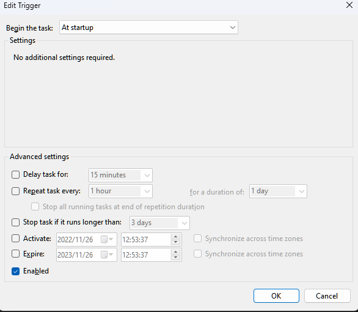
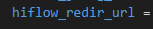

# CAU 校园网自动联网

## 安装依赖 
- Python 3
```bash
 pip install -r requirement.txt
```

## 使用方法
Windows 设备可以使用计划任务程序进行设置，关于计划任务的设置[参考](https://jingyan.baidu.com/article/414eccf60c40e32a431f0af6.html)

其中几个关键设置如下：
### 初始化程序
程序需要进行初始化，安装好环境后，在程序目录下，运行`python utils\config.py`初始化config参数，可自动生成config.ini文件，之后关于配置文件的修改，可以直接在config.ini中进行

### 启动程序

#### 程序或脚本设置为`run.vbs`

#### 触发器（自动化脚本）
双击`auto_add_to_scheduler.vbs`，点击管理员同意，即可

#### ~~触发器（手动）~~ 

 
~~触发器在向导阶段可以随机设置，然后再设置好的任务界面~~
- ~~右击刚刚设置的任务，点击属性~~

 
- ~~点击触发器，然后点击新增~~ 

 
- ~~设置时间，设置重复时间，根据自己的需要设置，这里设置的是5分钟，重复周期是1天（因为一天之后又会被重新触发），点击确定~~


- ~~再点击新增，设置开机自动执行程序~~



### 消息通知

设置HiFlow可以通知每次登录状态

需要将config.ini 中 修改为设置好的地址 


参考设置：
https://hiflow.tencent.com/share/VtAdheFZFVYg2whJHywjnS1CQTAXoBf1